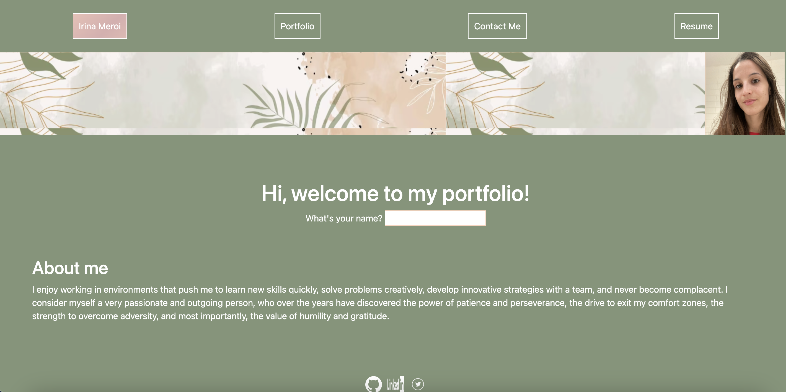

# irina-meroi-portfolio

## Description
This project contains my professional portfolio which was created using React. It includes a little description and a picture of me, my contact information, screenshots and the links to the GitHub repositories and websites I created/worked on, and a section providing my resume.

## Screenshots

## Link

## Installation
N/A

## Usage
My portfolio can be used by accessing it through the repository located in my GitHub account, or the link provided above. It redirects users to the home page of the portfolio, which provides a little description about me and a picture. From there, the porfolio link in the navigation contains images of some of the projects I've created or participated in, as well as the links of the deployed applications and the GitHub repository. In the navigation section it can also be found a path to my resume, where a copy of it can we download, and to a contact me section, where a fom can be filled in to make life easier. In the footer section of the website, links to my GitHub account, my LinkedIn account and my email are provided.

## License
None

## Credits
I was able to create this code thanks to the help of the TA, tutors and old codes that were given to us as learning tools.

## Questions
Please feel free to contact me with any questions or concerns at [irimeroi7@gmail.com](mailto:irimeroi7@gmail.com), or to visit my [Github account](https://github.com/irimeroi).